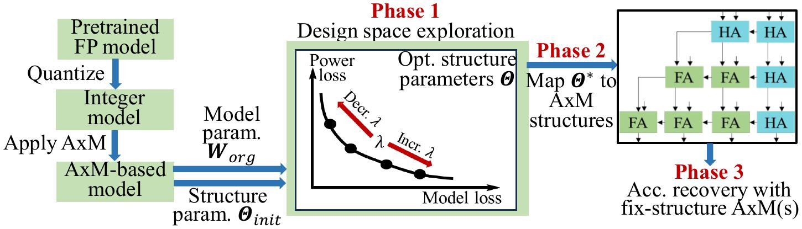

# TRAM: Training Approximate Multiplier Structures for Low-Power AI Accelerators

This repository implements **TRAM**, a hardware-software co-optimization framework
that *trains* approximate multiplier (AxM) structures for low-power AI accelerators.
Unlike prior work that designs AxMs separately from the AI model, TRAM jointly
optimizes the AxM **structure parameters** $\Theta$ and the model **weights**
$\mathbf{W}$ to lower power with small accuracy loss.
Its overall flow is shown below:


For details please refer to the paper:

[Chang Meng, Hanyu Wang, Yuyang Ye, Mingfei Yu, Wayne Burleson, and Giovanni De Micheli, "*TRAM: Training Approximate Multiplier Structures for Low-Power AI Accelerators*," in Design Automation Conference (DAC), Long Beach, CA, USA, 2026.](./paper/Meng_Wang_Ye_Yu_Burleson_De%20Micheli_TRAM%20Training%20Approximate%20Multiplier%20Structures%20for%20Low-Power%20AI%20Accelerators.pdf)


## Three-Phase Overview

TRAM starts from a pre-trained floating-point AI model that is first quantized
to integer arithmetic. AxMs then replace the accurate multipliers, and the
following three phases run end-to-end (see Figure 2 of the paper):

| Phase | What it does | Driver script |
|-------|--------------|---------------|
| **Phase 1 — Design-Space Exploration** | Joint gradient-based optimization of $\Theta$ and $\mathbf{W}$ on the loss $\mathcal{L}_{\text{power}}\!\cdot\!\lambda + \mathcal{L}_{\text{AI\_model}}$ (Eq. 2 in the paper). Produces continuous structure parameters $\Theta^{*}$. | [`main_phase1.py`](main_phase1.py) |
| **Phase 2 — AxM Structure Mapping** | Greedy column-wise mapping of $\Theta^{*(l)}$ to a *concrete* AxM netlist per layer; yields Verilog → BLIF → LUT artifacts. | [`als-mult/find_best_structure.py`](als-mult/find_best_structure.py) + [`simulator/sim.py`](simulator/sim.py) |
| **Phase 3 — Accuracy Recovery** | LUT-based fine-tuning of the model weights with the concrete AxMs frozen. | [`main_phase3.py`](main_phase3.py) |

Phase 0 (initial post-training quantization / quantization-aware training,
producing the w8a8 / w4a4 model that feeds phase 1) is handled by
[`main_qat.py`](main_qat.py).

## Download

```shell
git clone https://github.com/changmg/TRAM.git
cd TRAM
```


## Dependencies & Build

- Reference OS: Ubuntu 20.04 LTS
- Reference AI environment: Python 3.11, PyTorch 2.3 + CUDA 12.4

Three install steps from the project root:

1. **Python packages** (see [`requirements.txt`](requirements.txt)):
   ```shell
   pip install -r requirements.txt
   ```

2. **CUDA self-ops** ([`self_ops/`](self_ops/)) — builds the `approx_ops` extension
   that supplies the LUT-based forward/backward GEMM kernels used by phase 3:
   ```shell
   python ./setup.py build_ext --inplace
   ```
   On success you will see `approx_ops.cpython-3xx-x86_64-linux-gnu.so` in the
   project root.

3. **Yosys** — only required for phase 2 (Verilog → BLIF synthesis):
   ```shell
   sudo apt install yosys
   ```

## Project Structure

Folders in the project root:

| Folder        | Purpose |
|---------------|---------|
| `als-mult/`   | Phase 2 mapping — turns continuous structure parameters $\Theta^{*}$ into a concrete AxM Verilog netlist. |
| `app_mults/`  | Third-party AxM library: BLIF netlists from EvoApprox (`evo_selected/`) and OPACT (`OPACT/`), with the reference simulator outputs used as ground truth. |
| `conf/`       | Global configuration (dataset paths, logger). Edit `global_vars.py` to point at your CIFAR-10 / ImageNet directories. |
| `models/`     | Network factories for CIFAR-10 (`models/cifar10/`) and ImageNet (`models/imagenet/`) — ResNet, DenseNet, VGG, etc. |
| `paper/`      | DAC'26 PDF and the overview figure used in this README. |
| `quant/`      | Quantization framework: PTQ + QAT layers, the `QuantModel` used by phase 1, and the LUT-aware variant used by phase 3. |
| `self_ops/`   | CUDA / C++ extension `approx_ops` providing LUT-based forward/backward GEMM kernels (built by `setup.py`). |
| `simulator/`  | Bit-parallel BLIF simulator (`sim.py`) plus the vendored `blifparser/` package and the BLIF specification PDF. |
| `utils/`      | Common helpers and dataset loaders for CIFAR-10/100, ImageNet, TinyImageNet. |

Top-level files:

| File | Purpose |
|------|---------|
| `main_qat.py`                  | Phase 0 — post-training quantization (w8a8) or quantization-aware training (w4a4). |
| `main_phase1.py`               | Phase 1 — design-space exploration; joint training of $\Theta$ and $\mathbf{W}$. |
| `main_phase3.py`               | Phase 3 — LUT-based accuracy recovery with the concrete AxMs frozen. |
| `demo_resnet18_cifar10.ipynb`  | Guided end-to-end demo notebook on ResNet18 / CIFAR-10. |
| `setup.py`                     | Build script for the `approx_ops` CUDA extension. |


## Pretrained Models

All pretrained models used in the paper are available from
[our GitHub release](https://github.com/changmg/TRAM/releases/tag/v1.0.0):

| File | Notes |
|------|-------|
| `cifar10_resnet{18,34,50}_fp32.pth`, `cifar10_densenet161_fp32.pth` | FP32 baseline |
| `cifar10_resnet{18,34,50}_w8a8_ptq.pth` | w8a8 PTQ (input to phase 1) |
| `cifar10_densenet161_w4a4_qat.pth` | w4a4 QAT (input to phase 1) |
| `imagenet_{deit_small,swin_small}_fp32.pth` | FP32 baseline |
| `imagenet_{deit_small,swin_small}_w8a8_ptq_cw_learnclip_asym.pth` | ImageNet ViT w8a8 |

The notebook in the *Quick Start* section below fetches the two ResNet18 checkpoints automatically.


## Quick Start

The fastest way to see TRAM run end-to-end on **ResNet18 / CIFAR-10 / w8a8** is to open
[`demo_resnet18_cifar10.ipynb`](demo_resnet18_cifar10.ipynb) and step through it.
The notebook is also the recommended re-implementation reference: it walks
through every phase, downloads the checkpoints, and reproduces two paper numbers
exactly — the **AccMul** baseline marker for ResNet18 in Figure 4 (notebook §2,
1× CUDA GPU) and every numeric column of paper Table 1 (notebook §6, CPU only).

## Misc

- The number of approximated columns $P$ (Section 3.2) defaults to 4 for CIFAR-10
  and is set in `prepare_trainappmult(num_max_discard_cols=8, num_init_discard_cols=4)`
  inside [`main_phase1.py`](main_phase1.py) and
  [`main_phase3.py`](main_phase3.py).

- **The CUDA AppMult kernel is bit-width-specialized at compile time.**
  [`self_ops/src/approx_mult.h`](self_ops/src/approx_mult.h) hardcodes
  ```cpp
  #define QUANTIZATION_BIT 8
  ```
  on line 12, with `#elif` arms covering `{4, 6, 7, 8}` (anything else triggers
  `#error "Unsupported QUANTIZATION_BIT"`). The default 8 matches the w8a8
  experiments in the paper. To experiment with a different bit-width:
  1. Edit line 12 of [`self_ops/src/approx_mult.h`](self_ops/src/approx_mult.h)
     (e.g. `#define QUANTIZATION_BIT 4` for w4a4).
  2. Rebuild the extension: `python ./setup.py build_ext --inplace`.
  3. Pass the matching `--nbits_w <bw> --nbits_a <bw>` to `main_qat.py` /
     `main_phase1.py` / `main_phase3.py`. The Python-side LUT padding constants
     in [`self_ops/ops_py/approx_ops.py`](self_ops/ops_py/approx_ops.py) must
     agree with the macro, otherwise the kernel reads out-of-bounds LUT entries.


## Acknowledgment

- The vendored BLIF parser at [`simulator/blifparser/`](simulator/blifparser/) is
  the open-source [`mario33881/blifparser`](https://github.com/mario33881/blifparser)
  (MIT). See [`simulator/NOTICE.md`](simulator/NOTICE.md) for the upstream
  commit pin and license.

- The CIFAR-10 model implementations under [`models/cifar10/`](models/cifar10/)
  are derived from [`huyvnphan/PyTorch_CIFAR10`](https://github.com/huyvnphan/PyTorch_CIFAR10).

- The CUDA extension scaffolding at [`self_ops/`](self_ops/) follows the
  pattern from [`YuxueYang1204/CudaDemo`](https://github.com/YuxueYang1204/CudaDemo).

- The third-party AxM designs in [`app_mults/`](app_mults/) come from the
  EvoApprox library (Evo_*) and the OPACT compressor-tree synthesis tool
  (OPACT_*).
